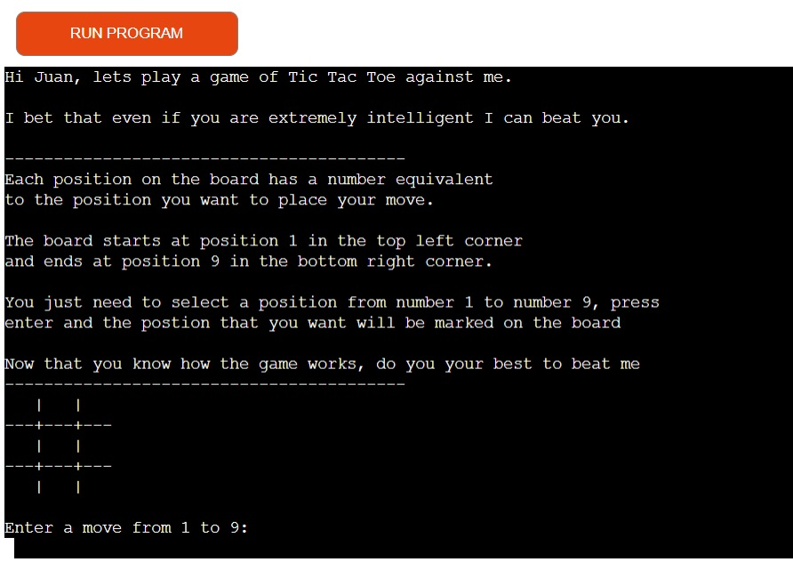
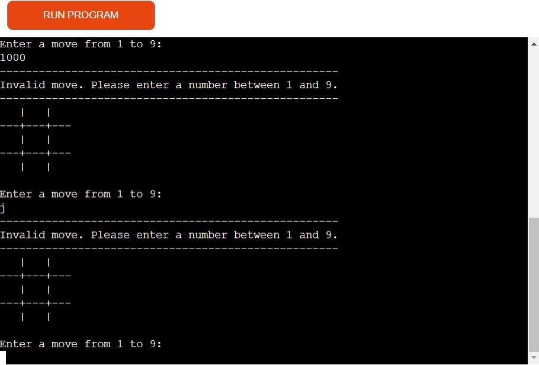
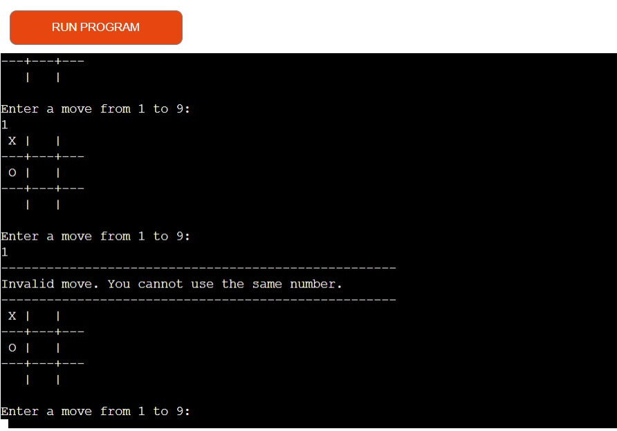
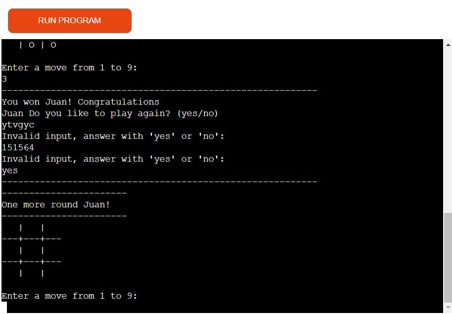

# Super Tic Tac Toe

Super Tic tac Toe is a Python terminal game, which runs in the Code Institute mock terminal on Heroku.

 

Users can try to beat the computer by matching 3 X's diagonally, vertically or horizontally on the Tic Tac Toe board before the computer matches 3 O's in the same positions described before.

 
<a href="https://tttpy.herokuapp.com/" target="_blank" aria-label="Visit Super Tic Tac Toe live website in the Code Institute mock terminal on Heroku. (Opens in another page)">Here is the live version of my project</a>
 

# How to play
Super Tic Tac Toe is based on the classic tic tac toe paper game. You can read more about it on <a href = "https://en.wikipedia.org/wiki/Tic-tac-toe" target="_blank" aria-label="Visit  Tic Tac Toe Wikipedia website (Opens in another page)">Wikipedia</a>
 

In this version, the player enters their name and a board is generate, so the player can choose where he will make his first movement.

Each position on the board has a number equivalent to the position you want to place your move.

The board starts at position 1 in the top left corner and ends at position 9 in the bottom right corner.

The user need to select a position from number 1 to number 9, press enter and the postion that the user  want will be marked on the board.

 
The players and the computer take turns marking the spaces in a three-by-three grid. The player who succeeds in placing three of their marks in a horizontal, vertical, or diagonal row is the winner.
 

The user will be represented by X and the computer by O.

# Features
<h2>Board generation</h2>

<ul>
    <li>
        
Rules are shown to the user when game start for better guidance

    </li>
    <li>
        
Board is generated for user first movement

    <li>
    <li>
        
Play against the computer

    </li>
    <li>
        
Accepts user input
    </li>
</ul>
<h2>Input Validation and error-checking</h2>

<ul>
    <li>
        
User can't enter coordinates outside the size od the board

    </li>
    <li>
        
User can't input letters or empty spaces instead of numbers on the board

    </li>
    <li>
        
User can't input the same guess twice

</ul>

<h2>Future Features</h2>
<ul>
    <li>
        
Add score to the game

    </li>
</ul>

# Testing

I have manually tested this project by doing the following:
<ul>
    <li>
        
Passed the code through a PEP8 linter and confirmed there are no problems

    </li>
    <li>
        
Given invalid inputs: strings when numbers are expected, out of bounds inputs, same input twice

    </li>
    <li>
        
Tested in my local terminal and the Code Institute Heroku terminal

    </li>
</ul>
 
<h2>Bugs</h2>
<h3>Solved Bugs<h3>
<ul>
    <li>
        
I couldnt invalidate users input if the user input empty spaces on the user name variable. I fixed by using the strip method.

    </li>
    <li>
        
When asked to play again the user was faced with the answer yes or no. If the user puts anything besides yes or no the code would collapse and give error messages. I find by adding a while statement with a lower method and a list containing "yes" and "no", if the user gives any different message from yes or no a message error is shown asking the user to use yes or no for answer.

    </li>
</ul>

